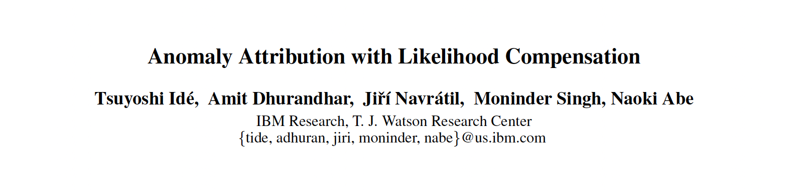
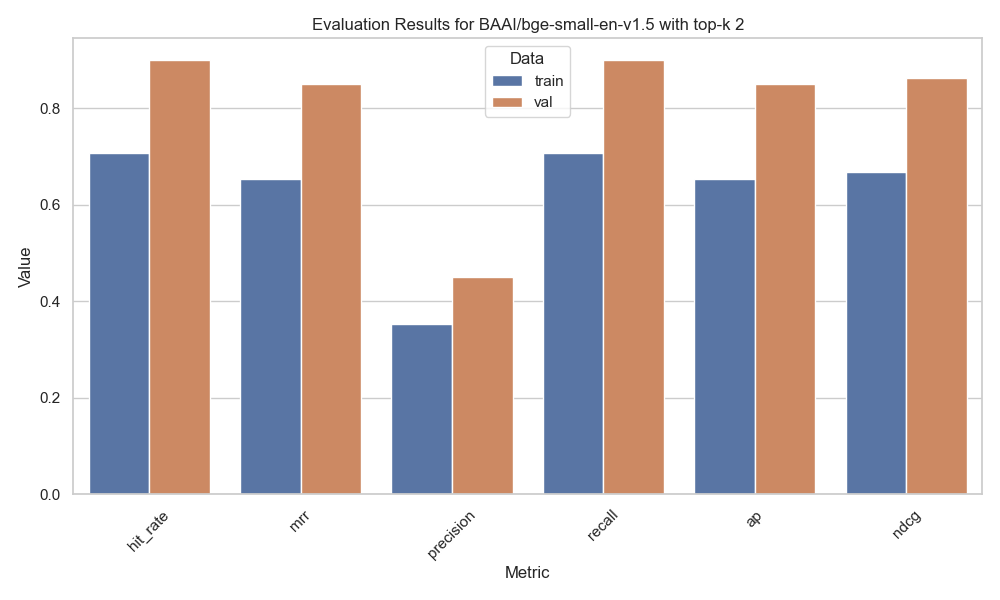
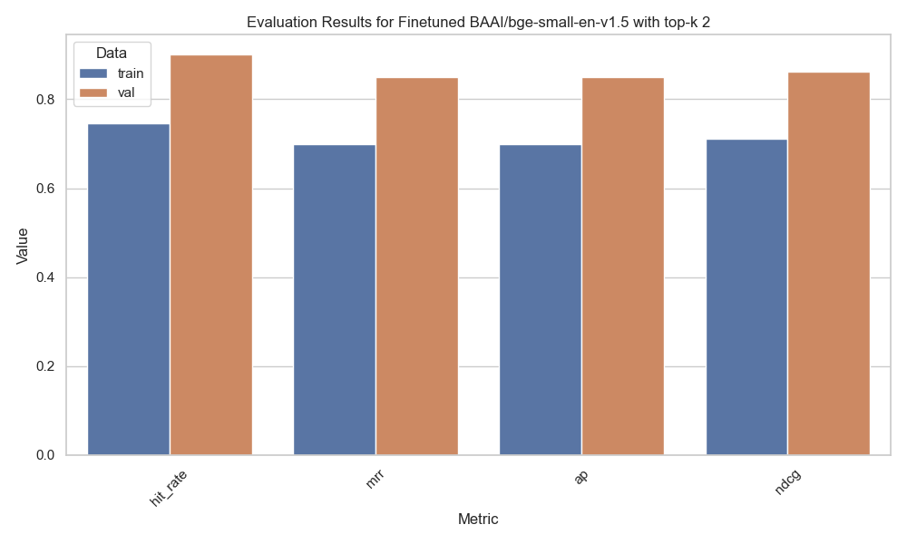

# Ready-To-Rag
*To rag or not to rag*

## What is RAG?
RAG (Retrieval-Augmented Generation) is a technique that combines retrieval-based methods with generative models to produce more accurate and contextually relevant responses. It retrieves relevant documents from a large corpus and uses them to generate answers. In this example we used a basic RAG using LlamaIndex and Hugging Face models.

# RAG for Scientific Papers 

## Getting Started
Follow these steps to run the Retrieval-Augmented Generation (RAG) pipeline on scientific papers in PDF format:

#### 1. Clone the repository
```sh
git clone https://github.com/giobbu/ready-to-rag.git
cd ready-to-rag
```

#### 2. Install Dependencies
Make sure you have Python installed, then install the required packages:
```sh
pip install -r requirements.txt
```

#### 3. Add Your PDF
Place the scientific paper you want to analyze in the following folder:
```sh
data/paper/
```

#### 4. Run the RAG Script
Use the following command to query the paper:
```sh
python main.py --query "<your-question-here>"
```

## Example

### Scientific Paper Input
Adding `anomaly-attribution.pdf` in `/data/paper/`. This example uses the paper:


### Configuration
In `config/setting.py`, ensure the following settings are applied:
```python
run_finetuning: bool = False
use_finetuned_model: bool = False
```

### Ask a question
Run the script with your query:
```sh
python main.py --query "What is the paper about?"
```

### Response Output
#### > Query
```sh
=== Calling Function ===
Calling function: summary_tool with args: {"input": "What is the paper about?"}
```
#### > Response
```sh
=== Function Output ===
{"response":"The paper addresses the task of explaining anomalous predictions of a black-box regression model by formalizing it as a statistical inverse problem and proposing a new method called likelihood compensation (LC) based on the likelihood principle.",
"confidence":0.95,
"confidence_explanation":"The response is based on a comprehensive overview of the content from the provided context information."}
```
## Evaluation (InProgress)

### Chunksize

This evaluation focuses on how the text-chunk size, `chunk_size`, influences the model's performance across three key metrics:

* **Average Faithfulness** (`FaithfulnessEvaluator`): measures how accurately the model reflects the input data without introducing errors or hallucinations.
* **Average Relevancy** (`RelevancyEvaluator`): assesses the relevance of the model's responses in relation to the input query.
* **Average Response Time**: calculates the time taken for the model to generate a response.

...

### Embedding 

run `python evaluator_embedding.py`

Evaluating embedding model's (finetuned and not) performance on question-answering (QA) training and validation datasets with `RetrieverEvaluator`.
In particular, the evaluation is conducted for each (query, text-chunks) pair by verifying whether the correct text-chunk appears within the `top-k` retrieved text-chunks.

* **Mean Hit Rate** (`hit_rate`): 1.0 if there is at least one relevant text-chunk among all the top k retrieved text-chunks;
* **Mean Reciprocal Rank** (`mrr`): the rank of the highest ranked relevant text-chunk, if any in the top k, 0 otherwise;
* **Average Precision** ([AP](https://www.wikiwand.com/en/articles/Evaluation_measures_(information_retrieval))) (`ap`): summarizes a precision-recall (PR) curve into a single value representing the average of all precisions;
* **Normalized Discounted Cumulative Gain** ([NDCG](https://www.wikiwand.com/en/articles/Discounted_cumulative_gain))(`ndcg`): measures the relevance of text-chunk in a ranked list, considering both the rank position and the relevance of the text-chunk.


#### `BAAI/bge-small-en-v1.5` WITHOUT finetuning


#### `BAAI/bge-small-en-v1.5` WITH finetuning


## Hyperparameters Evaluation (TODO)

