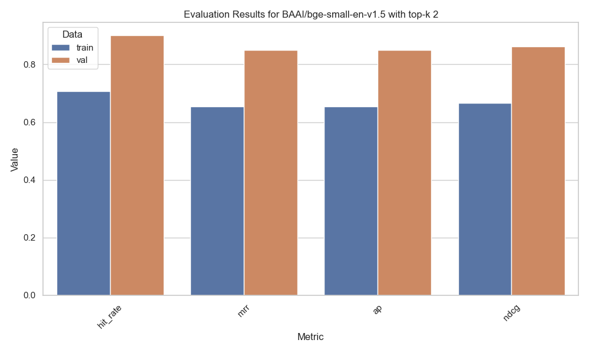

# Ready-To-Rag
*To rag or not to rag*

## What is RAG?
RAG (Retrieval-Augmented Generation) is a technique that combines retrieval-based methods with generative models to produce more accurate and contextually relevant responses. It retrieves relevant documents from a large corpus and uses them to generate answers. In this example we used a basic RAG using LlamaIndex and Hugging Face models.

# RAG for Scientific Paper in PDFs. 

## How to run the RAG

1. Clone the repository:
    ```sh
    git clone https://github.com/giobbu/ready-to-rag.git
    cd ready-to-rag
    ```

2. Install the required dependencies:
    ```sh
    pip install -r requirements.txt
    ```

3. Run the script:
    ```sh
    python main.py --query "<query>"
    ```

## Basic RAG

```sh
nano config.py
```

In the `Settings` set `run_finetuning` to `False` and `use_finetuned_model` to `True`, the RAG will give the following answer:

- **Query**:
> What is the paper about?

- **Response**:
> The paper discusses a method for explaining anomalies detected by an autoencoder using SHAP values. It includes a flow chart illustrating the explanation process and a table showing contributing and offsetting anomaly features based on SHAP values.

## Multi-index RAG

In the `Settings` by having `list_tools = ['Base', 'Meta', 'Summary']` the RAG will answer your questions by picking from different tools. 
* `Base` tool to perform basic vector search base on the top-k most similar embeddings. 
* `Meta` tool adds to `Base` the capability for metadata filtering. 
* `Summary` tool to synthesize an answer from all text chunks.

Here an example (Keep `run_finetuning` to `False` and `use_finetuned_model` to `True`):

- **Query**:
> Summarize the Introduction section from page 2 to 4.

- **Response**:
> Deep learning algorithms, particularly autoencoders, have been increasingly utilized for various tasks, including anomaly detection. While these algorithms are effective at identifying anomalies, explaining their outputs can be challenging. Providing explanations for anomalies can enhance trust in the algorithm among domain experts. Explanations can be particularly useful in understanding why one event occurred instead of another, which is crucial for anomaly detection. The need for explanations per instance, rather than for the entire model, has gained importance as machine learning models have become more complex, especially in domains like autonomous vehicles and healthcare where understanding the decision-making process is essential.

from logs: *`Calling function: metadata_vector_tool with args: {"query": "Introduction", "page_numbers": ["2", "3", "4"]}`*

## Evaluation

### Embedding

#### `BAAI/bge-small-en-v1.5` WITHOUT finetuning


#### `BAAI/bge-small-en-v1.5` WITH finetuning


## Hyperparameters Evaluation (TODO)

